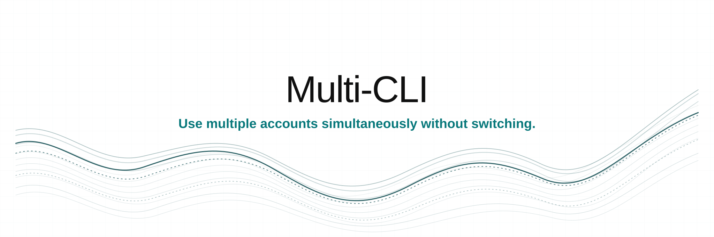

<p align="center">
  
</p>

<p align="center">Use multiple accounts simultaneously without switching.</p>

<p align="center">
  <a href="#supported-ai-tools"></a>
  <a href="release/VERSION"></a>
  <a href="#install"></a>
  <a href="LICENSE"></a>
</p>

<p align="center">
  <a href="README.md"><b>English</b></a> |
  <a href="docs/translations/es.md">Español</a> |
  <a href="docs/translations/ar.md">العربية</a> |
  <a href="docs/translations/zh.md">中文</a> |
  <a href="docs/translations/ru.md">Русский</a> |
  <a href="docs/translations/he.md">עברית</a>
</p>

## Contents

[Install](#install) · [Quick start](#quick-start) · [AI tools](#supported-ai-tools) · [Commands](#commands) · [Isolation](#how-isolation-works) · [Move sessions](#move-sessions-between-accounts) · [Troubleshooting](#troubleshooting) · [Uninstall](#uninstall)

## Install

### Requirements

- macOS or Linux: [Bash 3.2 or newer](https://www.gnu.org/software/bash/)
- Windows: [Windows PowerShell 5.1](https://www.microsoft.com/download/details.aspx?id=54616)
- [jq 1.7.1](https://jqlang.github.io/jq/download/), installed automatically when missing
- One of the [supported AI tools](#supported-ai-tools)

### Install from source

[Git](https://git-scm.com/downloads) is required for this method.

```bash
git clone https://github.com/Spielewoy/multi-cli.git
cd multi-cli
./install/install.sh --local
```

Windows PowerShell:

```powershell
git clone https://github.com/Spielewoy/multi-cli.git
cd multi-cli
.\install\install.ps1 -Local
```

## Quick start

```bash
multi-cli doctor
multi-cli new claude-cli/work
multi-cli claude-cli/work
```

## Supported AI tools

| AI tool | ID | Platforms | Account boundary |
|---|---|---|---|
| [AGY CLI](docs/adapters/agy-cli.md) | `agy-cli` | Windows | OS user |
| [Antigravity](docs/adapters/antigravity.md) | `antigravity` | Windows | OS user |
| [Claude Code](docs/adapters/claude-cli.md) | `claude-cli` | Windows, Linux, macOS API keys | File overlay |
| [Codex CLI](docs/adapters/codex.md) | `codex` | Windows, macOS, Linux | File overlay |
| [Codex Desktop](docs/adapters/codex-gui.md) | `codex-gui` | Windows | OS user |
| [Command Code](docs/adapters/commandcode.md) | `commandcode` | Windows, macOS, Linux | File overlay |
| [GitHub Copilot CLI](docs/adapters/copilot-cli.md) | `copilot-cli` | Windows, macOS, Linux | Process secret |
| [GitHub Copilot in VS Code](docs/adapters/copilot-vscode.md) | `copilot-vscode` | Windows | OS user |
| [Cursor CLI](docs/adapters/cursor-cli.md) | `cursor-cli` | Windows, macOS, Linux | Process secret |
| [Cursor Desktop](docs/adapters/cursor.md) | `cursor` | Windows, macOS, Linux | Isolated tool home |
| [Gemini CLI](docs/adapters/gemini-cli.md) | `gemini-cli` | Windows, macOS, Linux | File overlay |
| [Grok Build CLI](docs/adapters/grok-cli.md) | `grok-cli` | Windows, macOS, Linux | Process secret |
| [Kimi Code CLI](docs/adapters/kimi-cli.md) | `kimi-cli` | Windows, macOS, Linux | Process secret |
| [Kiro](docs/adapters/kiro.md) | `kiro` | Windows, macOS, Linux | OS user |
| [OpenCode](docs/adapters/opencode.md) | `opencode` | Windows, macOS, Linux | Isolated tool home |
| [Windsurf](docs/adapters/windsurf.md) | `windsurf` | Windows, macOS, Linux | OS user |
| [Zed](docs/adapters/zed.md) | `zed` | Windows | OS user |

See platform limits in the [support matrix](docs/support-matrix.md). Run `multi-cli tools` to check your machine.

## Commands

### Profiles

| Command | Action |
|---|---|
| `multi-cli new <tool>/<name>` | Create an account profile (credentials separate; normal state shared) |
| `multi-cli new <tool>/<name> --isolated` | Create a whole-root isolated profile when the AI tool supports it; aliases: `--isolate`, `-i` |
| `multi-cli new <tool>/<name> --from <template>` | Create a schema-v2 profile from a schema-v2 template |
| `multi-cli <tool>/<name>` | Launch a profile |
| `multi-cli launch <tool>/<name> [-- args...]` | Launch and pass arguments to the tool |
| `multi-cli list [<tool>]` | List profiles |
| `multi-cli clone <tool>/<src> <tool>/<dest>` | Copy a schema-v2 profile |
| `multi-cli rename <tool>/<old> <tool>/<new>` | Rename a profile |
| `multi-cli delete <tool>/<name>` | Delete a profile after confirmation |

### Credentials and portability

| Command | Action |
|---|---|
| `multi-cli auth set <tool>/<profile>` | Store a process secret in the OS credential store |
| `multi-cli auth status <tool>/<profile>` | Check whether that secret exists |
| `multi-cli auth clear <tool>/<profile>` | Remove that secret |
| `multi-cli continue <tool> <src> <dest> [--dry-run] [--no-merge]` | Copy supported session state, never credentials |
| `multi-cli template save <tool>/<profile> <name>` | Save a credential-free schema-v2 template |
| `multi-cli template list \| delete <name>` | List or delete templates |
| `multi-cli export <tool>/<name> [path]` | Export a schema-v2 profile |
| `multi-cli import <archive> <tool>/<name>` | Import a schema-v2 archive |

### Maintenance

| Command | Action |
|---|---|
| `multi-cli migrate <tool>/<name> [--dry-run] [--prefer-profile]` | Migrate a legacy profile to schema v2 |
| `multi-cli status` | Show profiles and sizes |
| `multi-cli stats` | Show profile storage use |
| `multi-cli doctor [--deep]` | Diagnose setup and optionally audit runtimes |
| `multi-cli completion {bash\|zsh\|powershell}` | Print shell completion setup |
| `multi-cli help` | Show every command |
| `multi-cli version` | Show the installed version |

## How isolation works

| Mode | What stays separate | What stays shared |
|---|---|---|
| File overlay | Declared credential files | Native configuration and conversations |
| Process secret | One credential injected into the child process | The tool's normal state |
| OS user | The product's fixed OS credential identity | Nothing unless the AI tool allows it |
| Isolated tool home | The entire tool home | Nothing |

Profiles use the narrowest supported boundary. `--isolated` creates a separate tool home. Fixed OS credentials use a Multi-CLI-owned OS user and require an elevated terminal on Windows.

AI tools using a process secret require one extra step:

```bash
multi-cli new cursor-cli/work
multi-cli auth set cursor-cli/work
multi-cli cursor-cli/work
```

Older profiles keep their original whole-root behavior. Preview migration with:

```bash
multi-cli migrate codex/work --dry-run
```

Only schema-v2 profiles, templates, and archives are portable. Migrate legacy profiles first.

## Move sessions between accounts

Copy supported conversation state when one account reaches a limit:

```bash
multi-cli continue codex work personal --dry-run
multi-cli continue codex work personal
multi-cli codex/personal
codex resume
```

`base` refers to the tool's normal home, so either side can be a profile or the default installation. Credentials are never copied. Session transfer is supported for `codex`, `claude-cli`, `gemini-cli`, and `commandcode`.

## Shell aliases

Each profile gets a shortcut such as `claude-cli-work`.

| Platform | Location |
|---|---|
| macOS and Linux | `~/MultiCliProfiles/bin/` |
| Windows | `~/MultiCliProfiles/bin/`, plus Start Menu shortcuts for GUI profiles |

## Configuration

| Variable | Default | Purpose |
|---|---|---|
| `MULTICLI_HOME` | `~/MultiCliProfiles` | Profile storage |
| `MULTICLI_OVERRIDE_BINARY` | unset | Override binary discovery for one launch |
| `MULTICLI_REPO` | GitHub repository | Override the install source |
| `MULTICLI_INSTALL_DIR` | platform default | Override the installation directory |

## Troubleshooting

```bash
multi-cli doctor
multi-cli doctor --deep
multi-cli tools
```

Restart the terminal if `multi-cli` or a new profile alias is not found after installation. The [support matrix](docs/support-matrix.md) covers product-specific requirements.

## Uninstall

macOS and Linux:

```bash
curl -fsSL https://raw.githubusercontent.com/Spielewoy/multi-cli/main/install/uninstall.sh | bash
```

Windows PowerShell:

```powershell
irm https://raw.githubusercontent.com/Spielewoy/multi-cli/main/install/uninstall.ps1 | iex
```

Profile data is preserved unless you confirm its removal.

## Links

- [Support matrix](docs/support-matrix.md)
- [Security policy](docs/SECURITY.md)
- [Contributing](docs/CONTRIBUTING.md)
- [Support](docs/SUPPORT.md)

## License

[MIT](LICENSE)
