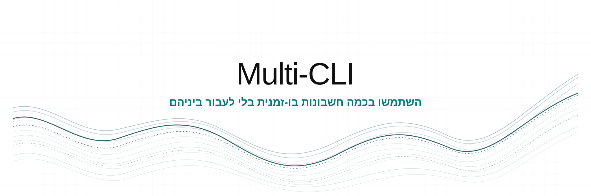

<div dir="rtl">

<p align="center">
  
</p>

<p align="center">השתמשו בכמה חשבונות בו-זמנית בלי לעבור ביניהם.</p>

<p align="center">
  <a href="#supported-tools"></a>
  <a href="https://github.com/Spielewoy/multi-cli/releases/latest"></a>
  <a href="#install"></a>
  <a href="../../LICENSE"></a>
</p>

<p align="center">
  <a href="../../README.md">English</a> |
  <a href="es.md">Español</a> |
  <a href="ar.md">العربية</a> |
  <a href="zh.md">中文</a> |
  <a href="ru.md">Русский</a> |
  <a href="he.md"><b>עברית</b></a>
</p>

## תוכן העניינים

[התקנה](#install) · [התחלה מהירה](#quick-start) · [כלים נתמכים](#supported-tools) · [פקודות](#commands) · [בידוד](#how-isolation-works) · [העברת סשנים](#move-sessions-between-accounts) · [פתרון תקלות](#troubleshooting) · [הסרת התקנה](#uninstall)

<a id="install"></a>

## התקנה

השתמשו בסקריפט ההתקנה לפלטפורמה שלכם, או הורידו חבילה מוכנה מ-[GitHub Releases](https://github.com/Spielewoy/multi-cli/releases).

### macOS ו-Linux

```bash
curl -fsSL https://raw.githubusercontent.com/Spielewoy/multi-cli/main/scripts/install.sh | bash
```

### Windows

פתחו את PowerShell:

```powershell
irm https://raw.githubusercontent.com/Spielewoy/multi-cli/main/scripts/install.ps1 | iex
```

תוכנית ההתקנה משכפלת או מעדכנת את Multi-CLI ומתקינה את `jq` במקרה הצורך. להפעלת עדכון, הריצו שוב את אותה הפקודה. לאחר ההתקנה יש להפעיל מחדש את הטרמינל. ב-macOS וב-Linux יש לפעול לפי הוראות ה-PATH אם הן מוצגות.

<details>
<summary><strong>התקנה מקוד המקור</strong></summary>

```bash
git clone https://github.com/Spielewoy/multi-cli.git
cd multi-cli
./scripts/install.sh --local
```

Windows PowerShell:

```powershell
git clone https://github.com/Spielewoy/multi-cli.git
cd multi-cli
.\scripts\install.ps1 -Local
```

</details>

דרישות: Git, חיבור לאינטרנט, Bash ב-macOS או ב-Linux, או PowerShell ב-Windows. תוכנית ההתקנה משיגה אוטומטית את קובץ ההפעלה הנדרש של `jq` כאשר הדבר אפשרי.

<a id="quick-start"></a>

## התחלה מהירה

```bash
# בדיקת ההגדרות ואיתור כלים מותקנים
multi-cli doctor
multi-cli tools

# יצירה והפעלה של פרופיל
multi-cli new claude-cli/work
multi-cli launch claude-cli/work

# הפעלה מקוצרת
multi-cli claude-cli/work
```

כברירת מחדל, פרטי האימות נשארים בתוך הפרופיל, בעוד הגדרות, שיחות, סוכנים, מיומנויות ותוספים נתמכים נשארים משותפים. השתמשו ב-`--isolated` רק עם מתאמים שתומכים בבידוד התיקייה כולה. מתאמים המבוססים על משתמש מערכת ההפעלה דוחים אותו, משום שהפניית תיקייה אינה מבודדת מאגר קבוע של פרטי אימות במערכת.

<a id="supported-tools"></a>

## כלים נתמכים

| כלי | מתאם | פלטפורמות | גבול החשבון |
|---|---|---|---|
| AGY CLI | `agy-cli` | Windows | משתמש מערכת ההפעלה |
| Antigravity | `antigravity` | Windows | משתמש מערכת ההפעלה |
| Claude Code | `claude-cli` | Windows, Linux, מפתחות API ב-macOS | שכבת קבצים |
| Codex CLI | `codex` | Windows, macOS, Linux | שכבת קבצים |
| Codex Desktop | `codex-gui` | Windows | משתמש מערכת ההפעלה |
| Command Code | `commandcode` | Windows, macOS, Linux | שכבת קבצים |
| GitHub Copilot CLI | `copilot-cli` | Windows, macOS, Linux | סוד תהליך |
| GitHub Copilot ב-VS Code | `copilot-vscode` | Windows | משתמש מערכת ההפעלה |
| Cursor CLI | `cursor-cli` | Windows, macOS, Linux | סוד תהליך |
| Cursor Desktop | `cursor` | Windows, macOS, Linux | תיקיית בית מבודדת לכלי |
| Gemini CLI | `gemini-cli` | Windows, macOS, Linux | שכבת קבצים |
| Grok Build CLI | `grok-cli` | Windows, macOS, Linux | סוד תהליך |
| Kimi Code CLI | `kimi-cli` | Windows, macOS, Linux | סוד תהליך |
| Kiro | `kiro` | Windows, macOS, Linux | משתמש מערכת ההפעלה |
| OpenCode | `opencode` | Windows, macOS, Linux | תיקיית בית מבודדת לכלי |
| Windsurf | `windsurf` | Windows, macOS, Linux | משתמש מערכת ההפעלה |
| Zed | `zed` | Windows | משתמש מערכת ההפעלה |

דרישות הפלטפורמות והמגבלות הידועות מתועדות ב[טבלת התמיכה](../support-matrix.md). הפעילו `multi-cli tools` כדי לראות אילו כלים זמינים במחשב.

<a id="commands"></a>

## פקודות

### פרופילים

| פקודה | פעולה |
|---|---|
| `multi-cli new <tool>/<name>` | יצירת פרופיל עם פרטי אימות נפרדים ומצב רגיל משותף |
| `multi-cli new <tool>/<name> --isolated` | יצירת פרופיל עם תיקייה מבודדת במלואה כאשר המתאם תומך בכך; כינויים: `--isolate`, `-i` |
| `multi-cli new <tool>/<name> --from <template>` | יצירת פרופיל בסכמה v2 מתבנית בסכמה v2 |
| `multi-cli <tool>/<name>` | הפעלת פרופיל |
| `multi-cli launch <tool>/<name> [-- args...]` | הפעלה והעברת ארגומנטים לכלי |
| `multi-cli list [<tool>]` | הצגת פרופילים |
| `multi-cli clone <tool>/<src> <tool>/<dest>` | העתקת פרופיל בסכמה v2 |
| `multi-cli rename <tool>/<old> <tool>/<new>` | שינוי שם של פרופיל |
| `multi-cli delete <tool>/<name>` | מחיקת פרופיל לאחר אישור |

### פרטי אימות וניידות

| פקודה | פעולה |
|---|---|
| `multi-cli auth set <tool>/<profile>` | שמירת סוד תהליך במאגר פרטי האימות של מערכת ההפעלה |
| `multi-cli auth status <tool>/<profile>` | בדיקה אם הסוד קיים |
| `multi-cli auth clear <tool>/<profile>` | הסרת הסוד |
| `multi-cli continue <tool> <src> <dest> [--dry-run] [--no-merge]` | העתקת מצב סשן נתמך, ללא פרטי אימות |
| `multi-cli template save <tool>/<profile> <name>` | שמירת תבנית בסכמה v2 ללא פרטי אימות |
| `multi-cli template list \| delete <name>` | הצגת תבניות או מחיקתן |
| `multi-cli export <tool>/<name> [path]` | ייצוא פרופיל בסכמה v2 |
| `multi-cli import <archive> <tool>/<name>` | ייבוא ארכיון בסכמה v2 |

### תחזוקה

| פקודה | פעולה |
|---|---|
| `multi-cli migrate <tool>/<name> [--dry-run] [--prefer-profile]` | העברת פרופיל ישן ל-schema v2 |
| `multi-cli status` | הצגת פרופילים וגדלים |
| `multi-cli stats` | הצגת נפח האחסון של הפרופילים |
| `multi-cli doctor [--deep]` | אבחון ההגדרות ובדיקה אופציונלית של סביבות ההרצה |
| `multi-cli completion {bash\|zsh\|powershell}` | הצגת הגדרות השלמה אוטומטית ל-shell |
| `multi-cli help` | הצגת כל הפקודות |
| `multi-cli version` | הצגת הגרסה המותקנת |

<a id="how-isolation-works"></a>

## איך הבידוד עובד

| מצב | מה נשאר נפרד | מה נשאר משותף |
|---|---|---|
| שכבת קבצים | קובצי פרטי האימות שהוגדרו | ההגדרות והשיחות הרגילות של הכלי |
| סוד תהליך | פרט אימות אחד שמוזרק לתהליך הבן | המצב הרגיל של הכלי |
| משתמש מערכת ההפעלה | זהות פרטי האימות הקבועה של המוצר | שום דבר, אלא אם המתאם מצהיר אחרת |
| תיקיית בית מבודדת לכלי | כל תיקיית הבית של הכלי | שום דבר |

פרופילי חשבונות משתמשים בגבול הבטוח המצומצם ביותר. `--isolated` משתמש בתיקייה נפרדת ואינו משתף דבר, אך פועל רק עם מתאמים שתומכים בבידוד התיקייה כולה. מתאמים המבוססים על משתמש מערכת ההפעלה דוחים אותו, משום שהפניית תיקייה אינה מבודדת מאגר קבוע של פרטי אימות. מוצרים שמקושרים לזהות זו משתמשים במשתמש מערכת הפעלה שמנוהל על ידי Multi-CLI; ב-Windows נדרש טרמינל עם הרשאות מנהל.

מתאמים שמשתמשים בסוד תהליך דורשים צעד נוסף לפני ההפעלה:

```bash
multi-cli new cursor-cli/work
multi-cli auth set cursor-cli/work
multi-cli cursor-cli/work
```

פרופילים שנוצרו בגרסאות קודמות של Multi-CLI שומרים על בידוד תיקיית הבית המקורי. ניתן לראות תצוגה מקדימה של ההעברה באמצעות:

```bash
multi-cli migrate codex/work --dry-run
```

רק פרופילים, תבניות וארכיונים בסכמה v2 ניתנים להעברה. יש להעביר תחילה פרופיל מקור ישן לסכמה v2 לפני שכפולו או יצירת תבנית או ייצוא חדשים.

<a id="move-sessions-between-accounts"></a>

## העברת סשנים בין חשבונות

העתיקו מצב שיחה נתמך כאשר חשבון מגיע למגבלה שלו:

```bash
multi-cli continue codex work personal --dry-run
multi-cli continue codex work personal
multi-cli codex/personal
codex resume
```

`base` מייצג את תיקיית הבית הרגילה של הכלי, לכן כל צד יכול להיות פרופיל או התקנת ברירת המחדל. פרטי אימות לעולם אינם מועתקים. העברת סשנים נתמכת עבור `codex`, `claude-cli`, `gemini-cli` ו-`commandcode`.

## כינויים ב-shell

כל פרופיל מקבל קיצור דרך כמו `claude-cli-work`.

| פלטפורמה | מיקום |
|---|---|
| macOS ו-Linux | `~/MultiCliProfiles/bin/` |
| Windows | `~/MultiCliProfiles/bin/`, וכן קיצורי דרך בתפריט ההתחלה עבור פרופילים גרפיים |

## הגדרות

| משתנה | ברירת מחדל | מטרה |
|---|---|---|
| `MULTICLI_HOME` | `~/MultiCliProfiles` | אחסון פרופילים |
| `MULTICLI_OVERRIDE_BINARY` | לא מוגדר | עקיפת איתור קובץ ההפעלה להפעלה אחת |
| `MULTICLI_REPO` | מאגר GitHub | עקיפת מקור ההתקנה |
| `MULTICLI_INSTALL_DIR` | ברירת המחדל של הפלטפורמה | עקיפת תיקיית ההתקנה |

<a id="troubleshooting"></a>

## פתרון תקלות

```bash
multi-cli doctor
multi-cli doctor --deep
multi-cli tools
```

הפעילו מחדש את הטרמינל אם `multi-cli` או הכינוי של פרופיל חדש אינם נמצאים לאחר ההתקנה. [טבלת התמיכה](../support-matrix.md) כוללת דרישות ספציפיות לכל מוצר.

<a id="uninstall"></a>

## הסרת התקנה

macOS ו-Linux:

```bash
curl -fsSL https://raw.githubusercontent.com/Spielewoy/multi-cli/main/scripts/uninstall.sh | bash
```

Windows PowerShell:

```powershell
irm https://raw.githubusercontent.com/Spielewoy/multi-cli/main/scripts/uninstall.ps1 | iex
```

נתוני הפרופילים נשמרים אלא אם מאשרים את מחיקתם.

## קישורים

- [טבלת התמיכה](../support-matrix.md)
- [מדיניות אבטחה](../SECURITY.md)
- [תרומה](../CONTRIBUTING.md)
- [תמיכה](../SUPPORT.md)
- [גרסאות GitHub](https://github.com/Spielewoy/multi-cli/releases)

## רישיון

[MIT](../../LICENSE)

</div>
